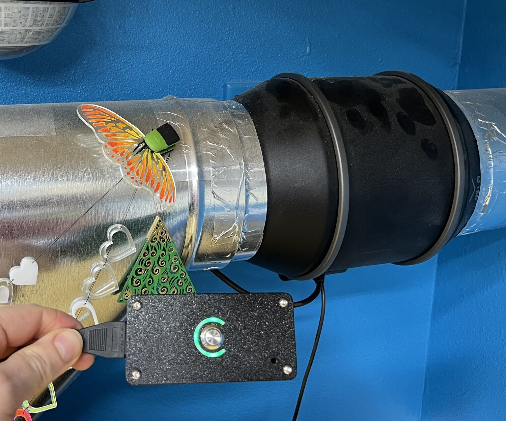
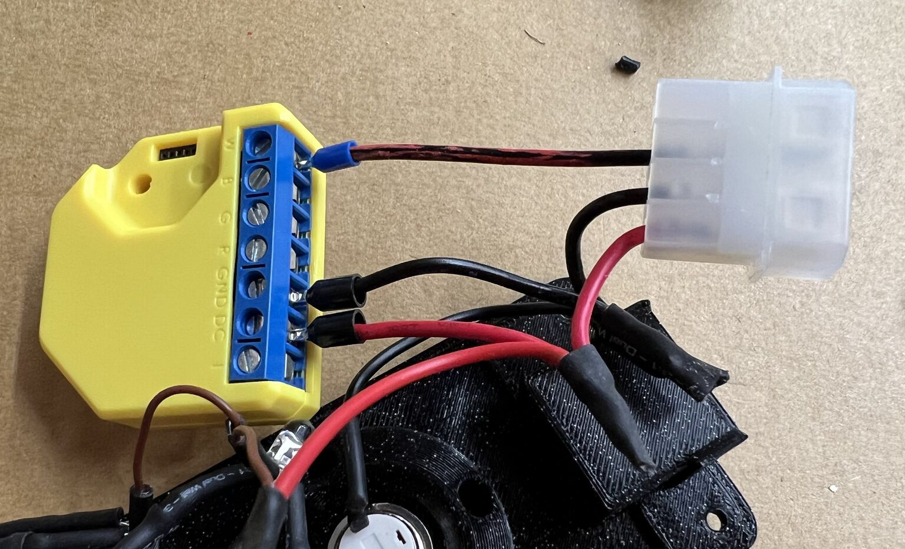
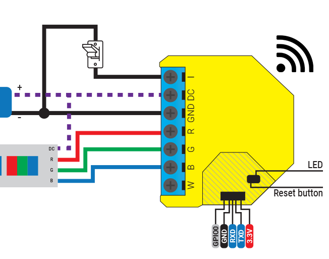

# esphome-shelly-cloudline

ESPHome configuration to drive an AC Infinity Cloudline S3 fan via a Shelly
RGBW-2. Though the fan only puts out 10V instead of 12V, this is still enough to
power the Shelly and a few LEDs. There are 3 versions of the config:

- Basic:
  - This is a basic config that just requires hooking the Shelly up to the molex
    connector.
  - Thanks to [unrepentantgeek](https://github.com/unrepentantgeek) for figuring
    out how to do this, and coming up with the initial config.
- 3-LED with button:
  - This version uses 3 separate single-color LEDs that will light in sequence
    to indicate the fan speed.
- RGB LEDs with button:
  - This version uses 3 RGB LEDs (_common anode!_) and changes the color of the
    LEDs based on the fan speed. This allows those of us with bad eyesight to
    identify the fan speed from a distance.
  - This is the version I made and that you see in my photos. However, it's a
    **very** tight squeeze to get everything to fit. If I were to do this again
    I would just use the 3-LED config and use one each of red/green/blue LEDs.

## 3D Printable Enclosure

There are 3 versions of the enclosure for this project
[available for download at Printables](https://www.printables.com/model/871384-enclosures-for-shelly-rgbw2-with-molex-connector/).
The basic version with no button can be printed in a single color, but you will
probably need a multi-color printer for the rest.

If you would like to try your hand at modifying the models fit your own printing
needs, [you can find all 3 versions in a single document at Onshape](https://cad.onshape.com/documents/973acda1573c9a2f05d17cd8/w/08205b342c0410fa4ea4ab3b/e/5799f8db24931f8f0b160ce1?renderMode=0&uiState=66399bc5ffe1e6234a3b93d3).

## Additional parts

- Shelly RGBW2
  - https://www.shelly.com/en-us/products/shop/shelly-rgbw2-us
- Molex connectors
  - https://www.amazon.com/gp/product/B00STNUB04/
  - It's cheaper to cut these up than to buy the individual components.
- 12mm buttons
  - https://www.amazon.com/gp/product/B0C8HPN318/
- 5mm RGB or single-color LEDs. I used clear ones but in retrospect frosted/diffused
  would probably work better for the indicators:
  - clear: https://www.amazon.com/dp/B01C19ENFK
  - frosted: https://www.amazon.com/dp/B01C3ZZT8C or https://www.amazon.com/dp/B077XD5T8P (the latter comes with resistors)
  - I used 470Ω resistors on green and red, and 220Ω+150Ω for blue. This is a
    bit high for red/green on 10V but helps balance out the dimmer blue.
- m3 screws (button head)
  - Up to 12mm long should fit, but you don't need anything that long.

## Instructions

For the basic setup, you just need to connect the first 3 wires from the molex
to DC, GND, and W (or you can edit the config and use a different PWM):

For the RGB and button setups, you will need to follow the
[Shelly wiring diagrams](https://kb.shelly.cloud/knowledge-base/shelly-rgbw2#ShellyRGBW2-Wiringdiagrams)
for both the button and the LED setup you are using. It's most likely the last
one of their examples that looks that looks like this:

- _Remember that the Shelly is designed for RGB strips with a common anode, so
  you will need to use the correct kind of RGB LEDs and/or hook single-color
  LEDs up "backwards" to how most of us are used to using them._
- _When calculating resistor values, remember that the fan puts out 10V, not the
  more customary 12V._

### Flashing Shelly with ESPHome

There doesn't seem to be a way to use the official Shelly firmware to control
the PWM outputs in the way that the fan needs, so you will need to re-flash it
with ESPHome (and one of the config files in this repository).

[Here is a great tutorial for how to do that](https://koen.vervloesem.eu/blog/flashing-a-shelly-rgbw2-with-crocodile-clips-and-cut-resistor-leads/).

## External References

Other users have attempted similar, however the design here using a Shelly is
preferred both for its ease of setup and electrical safety.

- https://www.rollitup.org/t/idiots-guide-to-getting-an-esp32-to-control-ac-infinity-cloudline-ec-fans-esphome-ha.1053910/
- https://community.home-assistant.io/t/ac-infinity-s-series-fan/485719
